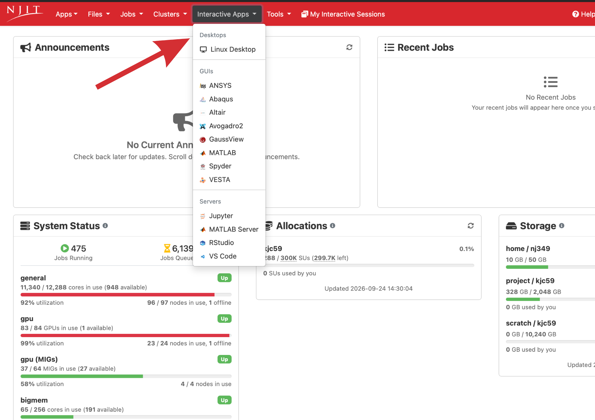

# Interactive Apps

## Overview

We have a lot of interactive apps which you can use for UI interface. They run as jobs in similar way as you would do using shell, except these are interactive. For example, you can start Jupyter Notebook app and work on it. Your files will be saved in directory created by the ondemand unless you specify a different directory during the configurations. 

{ width=100% height=100%}

!!! Warning
    Please make sure to close your app session once you have completed your work otherwise it will keep consuming SUs.

