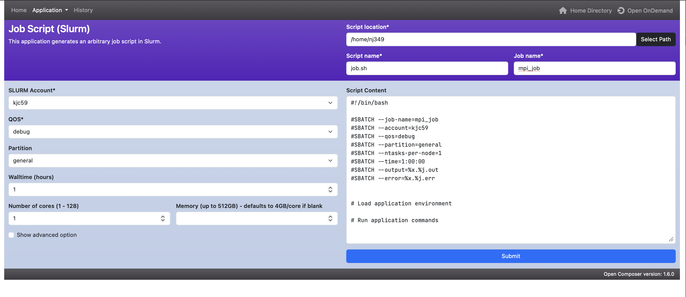
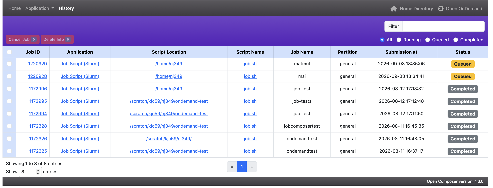

# Job Composer

The Job Composer provides a graphical interface for creating, editing, and
submitting Slurm jobs from templates, with a built-in file editor and job list.
No shell or local SSH required.

{ width=100% height=100%}

### Setting the Script Location and Names

At the top of the form:

- **Script location** — the directory where the script will be saved (defaults to
  your home directory, e.g. `/home/<UCID>`). Use **Select Path** to browse.
- **Script name** — the filename for the generated script (defaults to `job.sh`).
- **Job name** — the name your job will appear under in the scheduler.

### Job Parameters

Set the resource request on the left. As you change these, the corresponding
`#SBATCH` directives update in the **Script Content** box on the right.

- **SLURM Account** — the account the job is charged to (defaults to your account,
  e.g. `kjc59`). If you have more than one account, select the correct one.
- **QOS** — the quality of service (e.g. `debug`, `standard`). Use the
  [qoslist](../tools/) tool to confirm which QoS values your account can use.
- **Partition** — the partition to run on (`general`, `gpu`, `bigmem`, etc.).
- **Walltime (hours)** — the maximum run time.
- **Number of cores (1 – 128)** — cores requested on the node.
- **Memory (up to 512 GB)** — total memory; if left blank it defaults to 4 GB per core.

Check **Show advanced option** to configure additional settings such as a job array.

### Script Content

The **Script Content** box shows the generated script, which you can edit directly:

```bash
#!/bin/bash

#SBATCH --account=kjc59
#SBATCH --qos=debug
#SBATCH --partition=general
#SBATCH --ntasks-per-node=1
#SBATCH --time=1:00:00
#SBATCH --output=%x.%j.out
#SBATCH --error=%x.%j.err


# Load application environment

# Run application commands
```

Add your `module load` lines under **Load application environment** and your
program commands under **Run application commands**. Adjust the `#SBATCH`
directives as needed for your job.

!!! Note
    `%x.%j` in the output and error filenames expands to your job's name and job
    ID (e.g. `myjob.123456.out`).

### Submitting the Job

Click **Submit** to send the job to Slurm. You can review previously submitted
jobs from the **History** tab at the top of the application, and monitor active
jobs from the **Active Jobs** tool.

### History

The **History** page lists jobs you've submitted through the composer along with
their status. From there you can **Cancel** a running job or **Delete** an entry
from the History view (deleting an entry does not remove the job's files).

{ width=100% height=100%}


