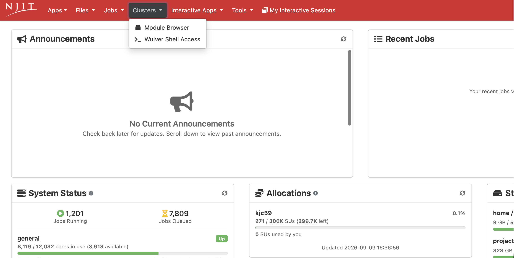

# Clusters
## Overview

The Clusters section provides browser-based access to the Wulver cluster along with a list of software modules available on the cluster.

{ width=100% height=100%}

### Web Shell Access

Web shell access provides a command-line interface to the Wulver cluster directly through your browser. The web shell functions like a standard terminal session on a login node, allowing users to run commands, submit and monitor jobs, and manage files without requiring a local SSH client.

{ width=100% height=100%}

!!! Tip
    If you are on Windows or do not have access to a local terminal or SSH client, the web shell provides a convenient alternative with no additional setup required.

### Module Browser

The Module Browser lets you search the software modules available on the cluster
without logging into a shell and running `module avail`.

